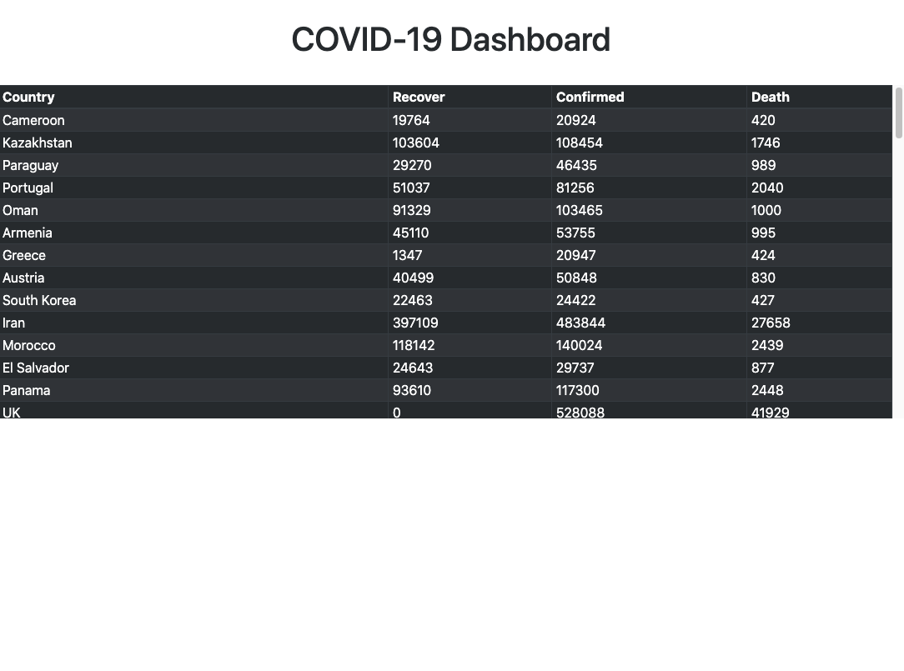

# COVID-19 Dashboard with Weather

COVID-19 Dashboard with Weather created "covidnow.com API" using Django Framework and hosted on Heroku.

Get inspiration and give credit to these two awesome developers.
<ul>
<li><a href="https://www.highcharts.com/blog/tutorials/create-a-dashboard-using-highcharts-and-django/">Create a Dashboard using Highcharts and Django</a></li>
<li><a href="https://www.freecodecamp.org/news/how-to-create-an-analytics-dashboard-in-django-app/">How to create an analytics dashboard in a Django app</a></li>
</ul>
