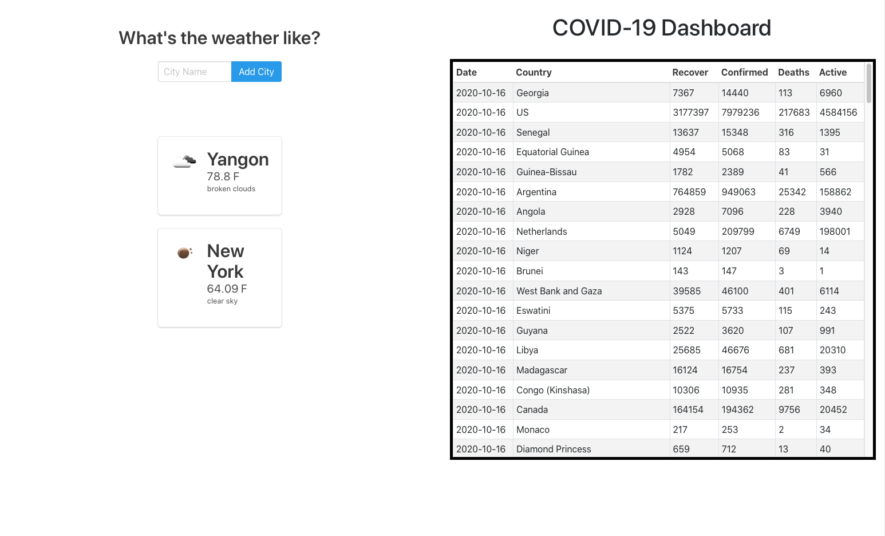

# COVIDdashboard

COVID-19 Dashboard created with covidnow.com API using Django Framework.

get inspiration and give credit to these two awesome developers.

<a href="https://www.highcharts.com/blog/tutorials/create-a-dashboard-using-highcharts-and-django/">Create a Dashboard using Highcharts and Django</a>
<a href="https://www.freecodecamp.org/news/how-to-create-an-analytics-dashboard-in-django-app/">How to create an analytics dashboard in a Django app</a>
